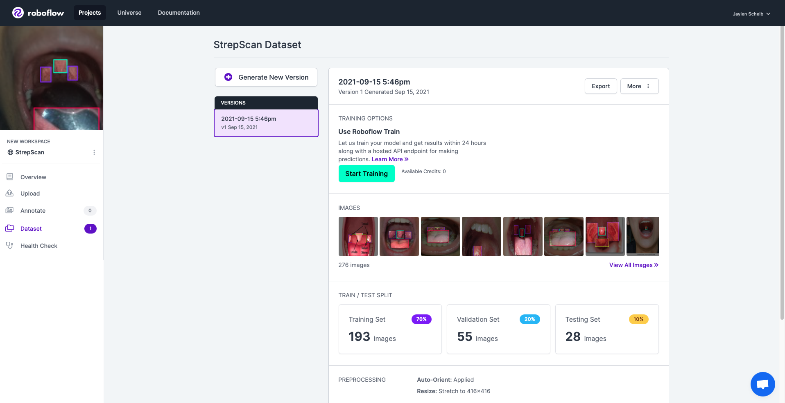
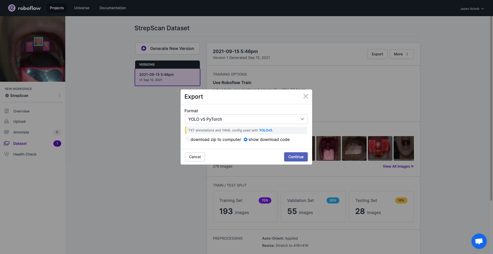

# Throat Parts Detection Model

The current model is a derivation of the [YOLOv5](https://pytorch.org/hub/ultralytics_yolov5/) (specifically, YOLOv5s) object detection model in PyTorch. The following will explain the process that was taken to create this throat part detection model.

## Images

Luckily, pre-classified images were already available from an existing project (found [here](https://github.com/strepscan/Convolutional-Neural-Network-Practice/tree/master/Images)), so all that is needed to do is to split up the images into `training`, `validation`, and `testing`. [Roboflow](https://roboflow.com) was used to preform the train/test split as their site offers easy methods for preprocessing, augmentations, and most importlantly, export to the YOLOv5 PyTorch format. The images were split into 70% `training`, 20% `validation`, 10% `testing`, and then exported.





## Training Prep

Start by cloning the YOLOv5 repo and installing dependencies.

```bash
$ git clone https://github.com/ultralytics/yolov5
$ cd yolov5
$ pip install -r requirements.txt
```

```python
import torch
from IPython.display import clear_output 

clear_output()
print(f"Setup complete. Using torch {torch.__version__} ({torch.cuda.get_device_properties(0).name if torch.cuda.is_available() else 'CPU'})")
```

**NOTE:** Training is signifigantly faster when using a GPU instead of a CPU. For examnple, to enable GPU utilization on Google Colab, simply go: Runtime > Change runtime type > Hardware accelerator: GPU.

Now bring in the throat parts dataset. If the "show download code" option was checked on roboflow export, then importing can be done by doing the following:

```python
torch.hub.download_url_to_file('download_link_here', 'tmp.zip')
```

```bash
$ unzip -q tmp.zip -d ../datasets && rm tmp.zip
```

Optionally, Tensorboard along with Weights & Biases can be used in the training process.

For Tensorboard:

```bash
$ load_ext tensorboard
$ tensorboard --logdir runs/train
```

For Weights & Biases:

```bash
$ pip install -q wandb
```

```python
import wandb
wandb.login()
```

## Training

To initiate training, run the following command:

```bash
$ python train.py --img 320 --batch 16 --epochs 1000 --data /datasets/data.yaml --weights yolov5s.pt --cache
```

`--data` is referring to the location of the `data.yaml` file present in the throat parts dataset. The training was done for 1000 epochs in this case, but is subject to change in possible future model iterations.

Note that this is based off of a **PRETRAINED** YOLOv5s model, another factor that is subject to change in future model iterations.

## Inference

To run an inference on the model with the test images, run the command:

```bash
$ python detect.py --weights /path_to/weights/best.pt --img 320 --conf 0.6 --source /datasets/test/images
```

## Export

Exporting of the model to Tensorflow.js has recently been made simple thanks to the work by GitHub user glenn-jocher found [here](https://github.com/ultralytics/yolov5/pull/4479). 

Simply run:

```bash
$ python export.py --img 320 --weights /path_to/weights/best.pt --include tfjs
```

The model will then be exported in the stucture of `model.json` and `.bin` files, as seen in this directory.
